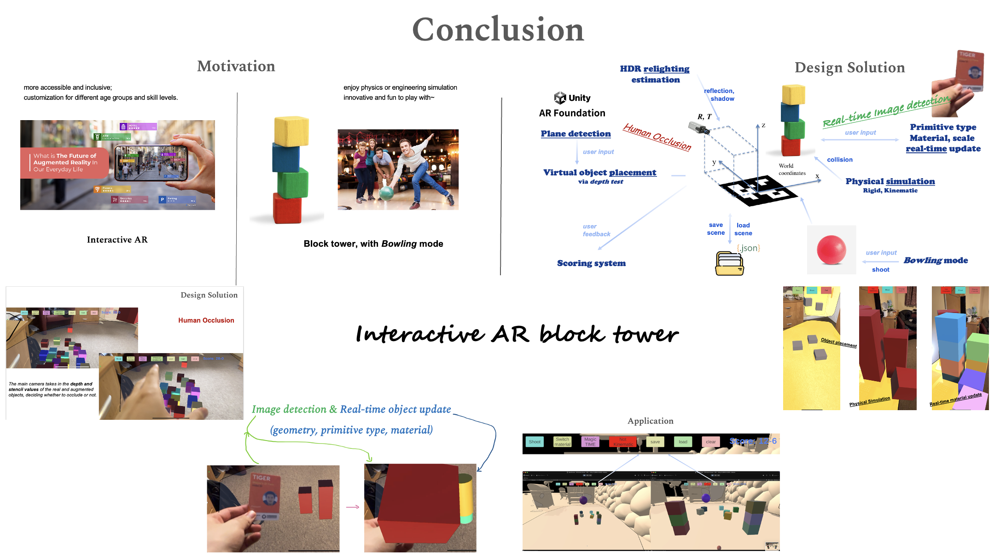
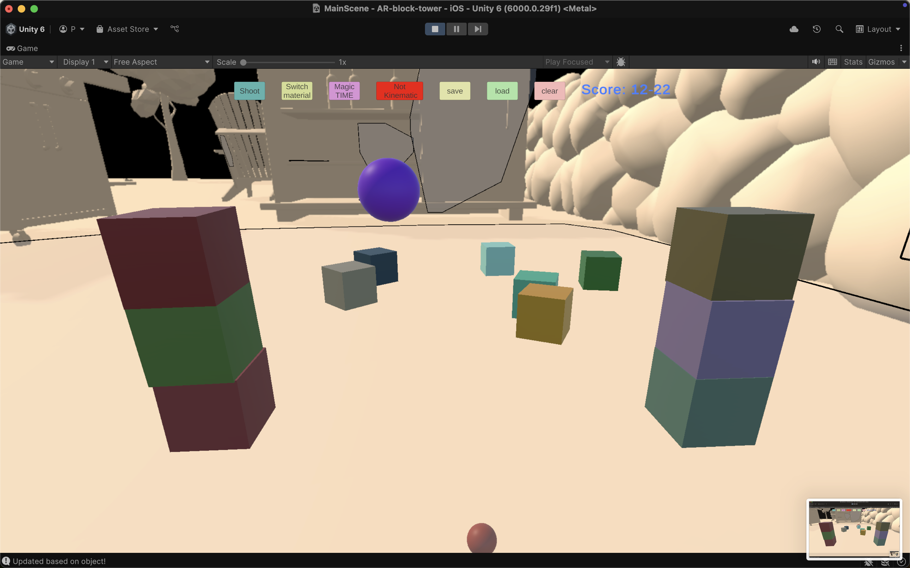
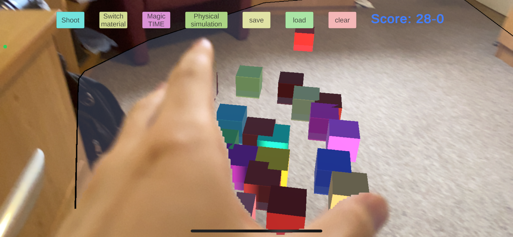
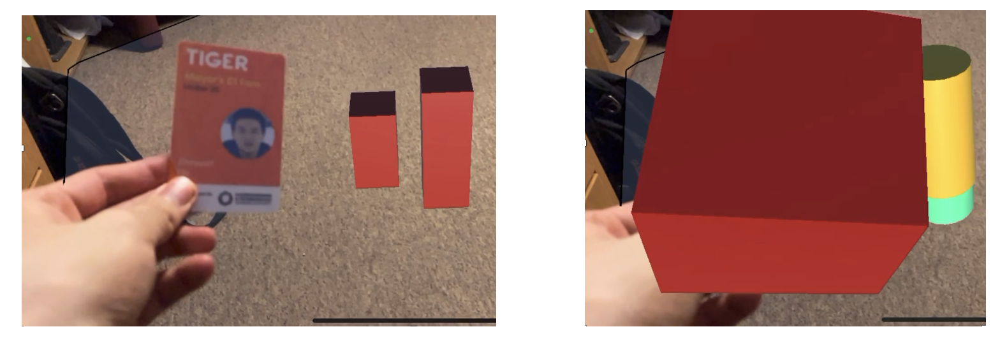

# Interactive AR block tower

This repo is my project for [Extended Reality (XR)](https://www.cl.cam.ac.uk/teaching/2425/ER/) module @ University of Cambridge, where I design a video based AR application.

## Mobile app

The mobile app is available for Android only. Please download the app from the [releases](https://github.com/PeterHUistyping/AR-block-tower/releases) page. Unfortunately, the ios version is not available due to the lack of an Apple Developer account.

## Web demo

Web demo is available only for non-AR version, due to lack of WebAR support (e.g. plane detection) in the Unity Engine. Please rebuild the project for your platform to test the full AR version.

## Technical report

The technical report is available [here](./docs/technical_report.pdf).

## How to play

1. Grant camera permissions
2. Place the tower based on detected plane
3. For more advanced features: please refer to the technical report.

### Human occlusion

### Image detection

Please change the tracked image in the Unity Editor, where the main scene is [here](./Assets/Scenes/MainScene.unity).

## Acknowledgement
Unity AR Foundation, related tutorials, and the Unity Asset Store.

Music: Town of Windhill.